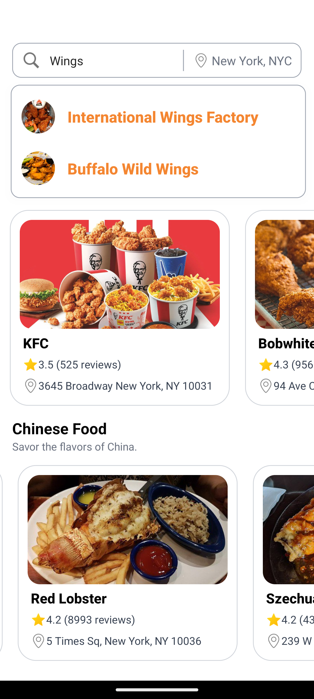
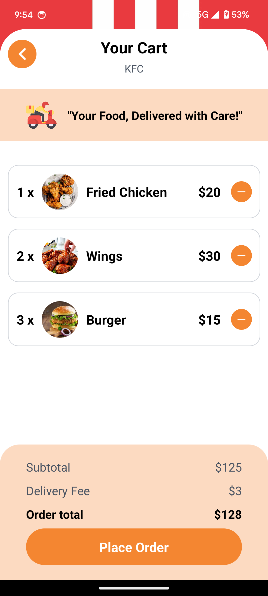
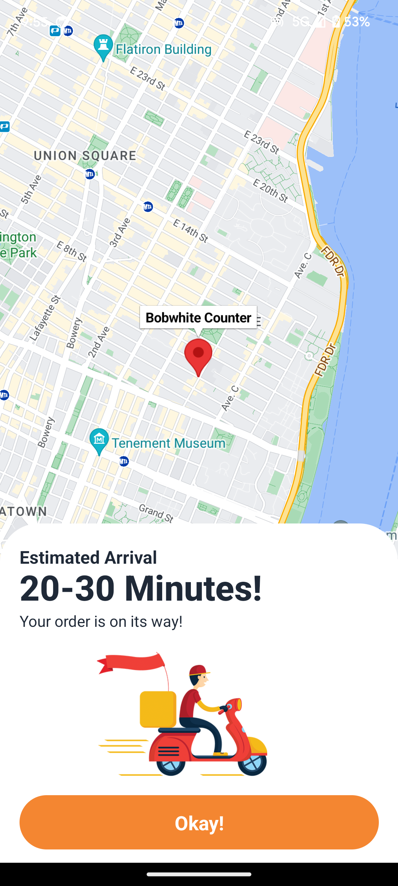

# Food Delivery App
A food delivery app built with React Native Expo, Sanity.io, React Redux ,Expo Maps and NativeWind. The app allows users to browse restaurants, view details, add items to the cart, and see the delivery location on the map.

## Features
- Browse a curated list of restaurants.
- Add dishes to the cart.
- View restaurant details and location on the map.
- Categorized restaurant listing.
- Integration with Google Maps API (Expo Maps) for location of the Restaurant.
- Manage state using Redux.
- Styled using NativeWind for utility-first design

## Technologies Used
- React Native Expo: For building the mobile app.
- Sanity.io: Headless CMS for managing all the data including restaurants , categories , etc.
- [Sanity.io](https://www.sanity.io/)
- Expo Maps: Integration with Google Maps for location tracking.
- Redux: For state management
- NativeWind: For utility-first styling in React Native

## Installation and Setup
1. Clone the repository
    ```js
    git clone https://github.com/aayushpatel205/food-delivery-app.git
    cd food-delivery-app
    ```
2. Install dependencies
    ```js
    npm install
    ```

3. Setting up Sanity
    - Install Sanity CLI
    ```js
    npm install -g @sanity/cli
    ```

    - Navigate to the sanity folder and run:
    ```js
    sanity start
    ```

4. Running the App
    ```js
    npx expo start
    ```

5. Building the App
    ```js
    npx expo build
    ```

## Screenshots









